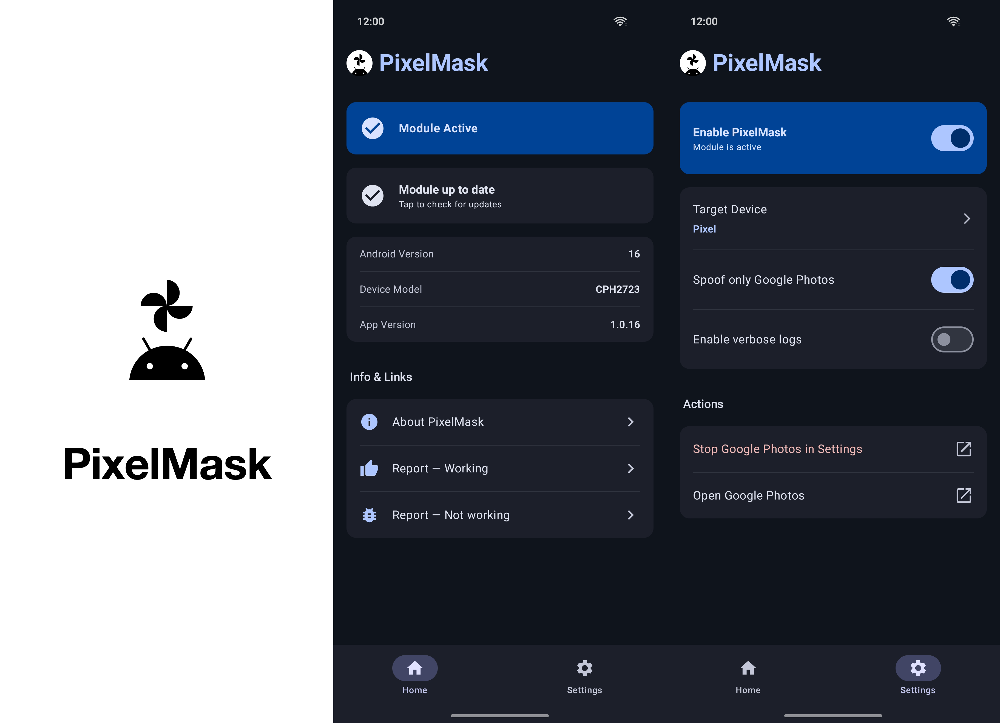
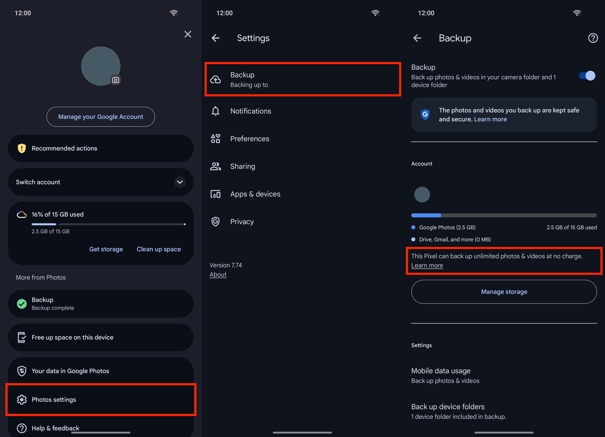

# PixelMask

Make Google Photos believe your phone is a Google Pixel — and unlock
Pixel-only perks like **free unlimited Original-quality backup** on any
rooted Android device.

> Forked from [BaltiApps/Pixelify-Google-Photos](https://github.com/BaltiApps/Pixelify-Google-Photos)
> (EOL since 2024) and rebuilt on a modern stack.

---

## What it does

Google Photos checks two things to decide whether you're on a Pixel:

- the device fingerprint (`Build.MANUFACTURER`, `MODEL`, `BRAND`, `FINGERPRINT`)
- a list of `hasSystemFeature("PIXEL_<year>_EXPERIENCE")` flags

PixelMask intercepts both — but only inside the Photos process, nothing else
on your phone is affected — and replies with the answers a Pixel of your
choosing would give. Photos then turns on the perks tied to that Pixel.

## Requirements

- Rooted Android 8.0 or newer (`arm64-v8a`)
- An Xposed framework — [LSPosed](https://github.com/LSPosed/LSPosed) on
  Magisk, or [zygisk-vector](https://github.com/HuskyDG/zygisk-vector) +
  LSPosed on KernelSU / APatch
- Google Photos installed

## Install

1. Download the latest **`PixelMask-x.y.z.apk`** from
   [Releases](https://github.com/kinginu/PixelMask/releases/latest).
2. Install the APK like any other.
3. Open **LSPosed Manager** → enable PixelMask.
4. **Scope it to Google Photos *and* to PixelMask itself.** Both. Without
   scoping the module to itself, the home screen sticks on *Module Not Active*
   even when the hook is working.
5. Force-stop Google Photos (the next section walks you through it from inside
   the app).

## Use it

1. Open **PixelMask** → switch to the **Settings** tab.
2. Tap **Target Device** and pick the Pixel you want Photos to think you're on
   (see [Which Pixel should I pick?](#which-pixel-should-i-pick) below).
3. Tap **Stop Google Photos in Settings** — that opens Android's app-info page
   for Photos. Tap *Force stop*. (We can't force-stop another app from inside
   PixelMask; only the system can.)
4. Tap **Open Google Photos** and let it start fresh.

That's it. The next time Photos starts, it sees the Pixel you picked.

## Did it actually work?

Photos doesn't pop up a "you're a Pixel now" banner, so this is the bit that
trips people up the most. Open Photos → tap your Google account icon
(top-right) → **Photos settings** → **Backup**. If the spoof is working,
you'll see this line:

> **This Pixel can back up unlimited photos & videos at no charge.**

If that line isn't there, the hook didn't fire. Common causes: forgot to
force-stop Photos after changing the target Pixel; forgot to scope the module
to itself in LSPosed; another module (`tricky_store`, `shamiko`,
`hidemyapplist`, …) is hiding LSPosed from Photos.

## Which Pixel should I pick?

| Target | What you get |
|---|---|
| **Pixel** *(default)* | **Lifetime unlimited Original-quality backup.** The original 2016 Pixel is the only model whose perk Google never rolled back. |
| Pixel 2 – Pixel 5 | Unlimited *Storage Saver* (compressed) backup. Useful if you want lots of backup but don't need full resolution. |
| Pixel 6 / 7 (Pro) | No notable Photos perk — Google ended the storage benefit for these generations. Pick one only if you're chasing a specific feature gate. |
| Pixel 8 Pro | Video Boost, Night Sight Video. |
| Pixel 9 Pro XL | Add Me, Reimagine, unlimited Magic Editor. |
| Pixel 10 Pro XL | Latest Pixel-first AI features. |

If you came here for free unlimited storage, **the original Pixel** is what
you want. The defaults are already set to it.

## Reporting

The Home tab has two report buttons that pre-fill a GitHub issue with
everything we need (your real device, Android version, the Pixel you spoofed
as, module version):

- **Report — Working** — tells us a new device combo works, helps build the
  compatibility matrix.
- **Report — Not Working** — opens a Not-Working template; please attach the
  LSPosed module log if you can grab it from
  *LSPosed Manager → Modules → PixelMask → Module logs*.

## Updates

The Home tab's update card hits `update_info.json` on this repo and points at
the latest release if there is one newer than what you have. Tap the card to
download. Re-installing the APK on top is enough — your settings are kept.

## For developers

Build instructions, hook architecture, the asset/banner pipeline, and the
release process all live in [docs/INTERNALS.md](docs/INTERNALS.md).

## Credits

- Forked from [BaltiApps/Pixelify-Google-Photos](https://github.com/BaltiApps/Pixelify-Google-Photos).
  Thank you for the original work.
- Launcher icon adapted from [Now in Android](https://github.com/android/nowinandroid)
  by The Android Open Source Project (Apache-2.0). The Bugdroid silhouette
  path is unchanged; the original `{}` mark above it was replaced with a
  4-blade pinwheel.

## License

MIT — see [LICENSE](LICENSE).

## Disclaimer

For research and educational use. No warranty. You are responsible for any
use of the module, including data loss or legal consequences in your
jurisdiction.
